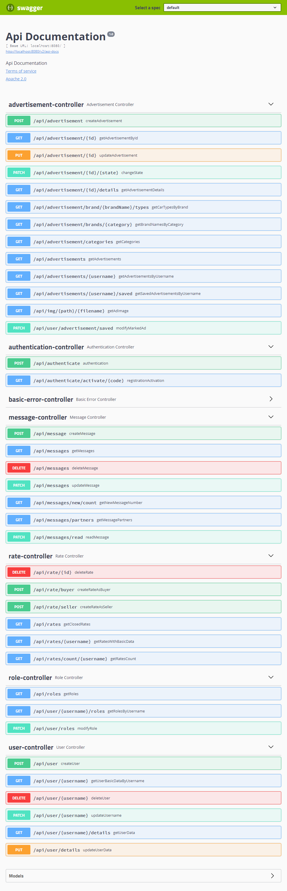

# eVehicle advertising Rest Api
- Built with Spring Boot and JPA, secured with JWT. 
## Requirements

Building the project requires JDK 11 or later and [Apache Maven](https://maven.apache.org/).

## Commands:

### Start with in-memory db :
 (initial user credentials: username: admin, password: admin)
- mvn package
- java -jar ./eVehicle-advertising-service/target/eVehicle-advertising-service-0.0.1-SNAPSHOT.jar
### Start in production mode with docker:
- docker compose build 
- docker compose up

- http://localhost:8080/swagger-ui.html 

